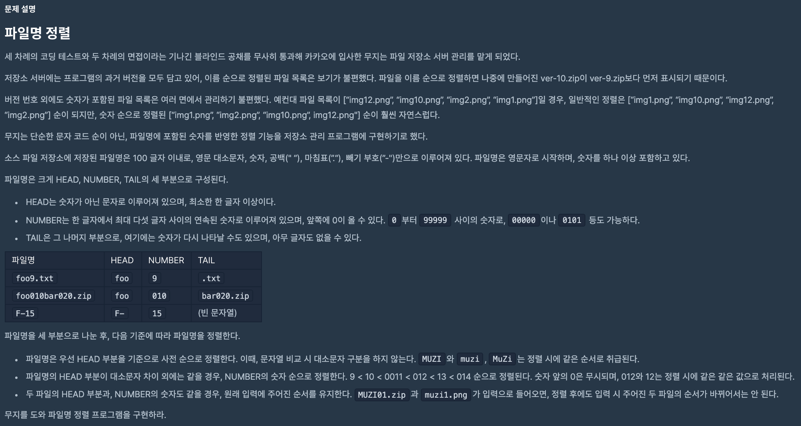

## Problem description

## Memo
Javascript의 sort함수가 unstable sort인걸 몰랐다.

그래서 테스트케이스 1, 2번을 제외하고 계속 실패가 떠서 많은 시간 헤맸다.

정렬되지 않은 상태에서 같은 키 값을 가진 원소의 순서가 일치하면 stable sort,

그렇지 않으면 unstable sort이다.

## References
[https://programmers.co.kr/learn/courses/30/lessons/17686](https://programmers.co.kr/learn/courses/30/lessons/17686)
